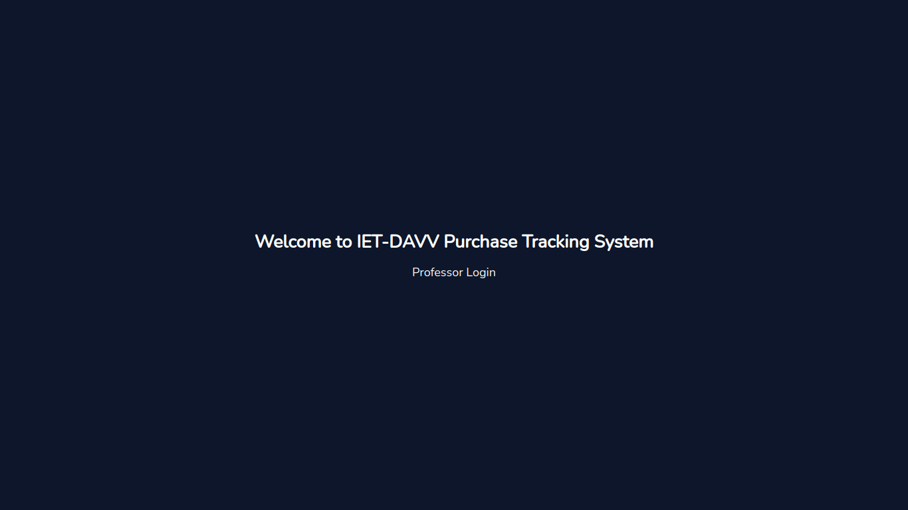
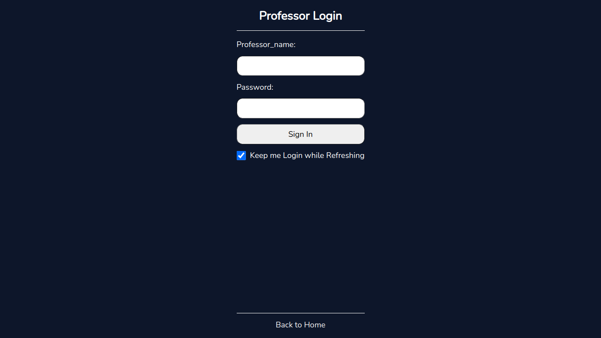
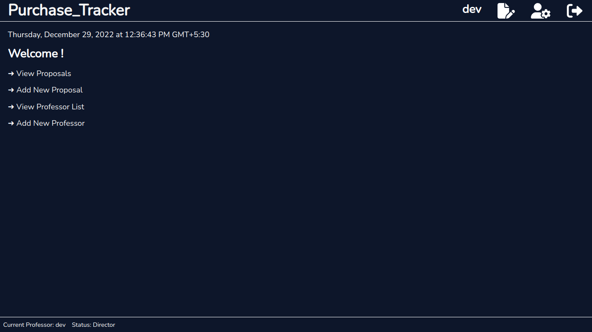
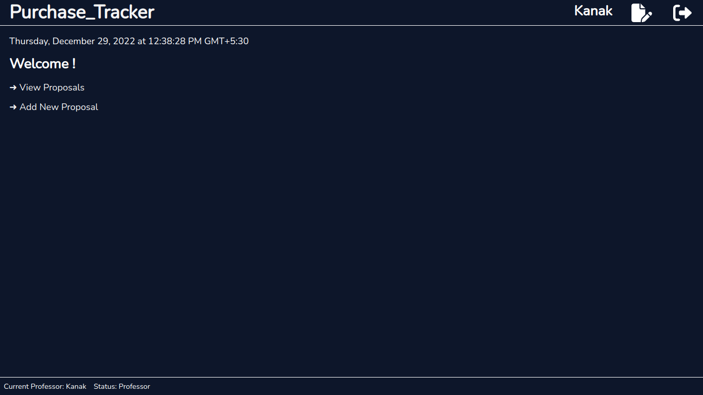
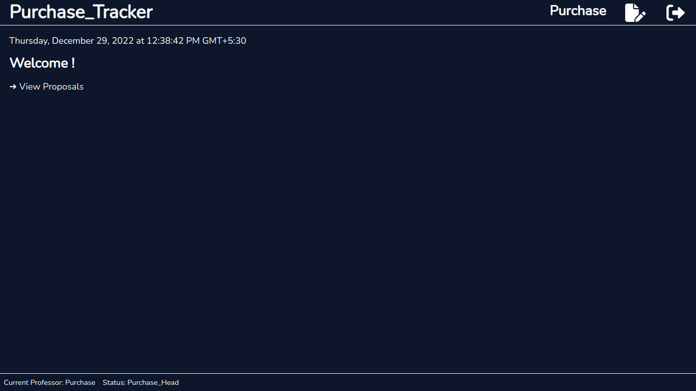

# IETPurchaseTrack App
It tracks the proposals for a particular purchase.I made this project for my college.

## Installation

Clone both backend and frontend repositories and install node modules in both frontend and backend by following command

```bash
npm install
```
and after that you have to set up the mongoDB database 

To start backend
```bash
npm run dev
```
To start frontend
```bash
npm start
```

## Visuals

### Welcome Page 




### Login Page




### Director's DashBoard




### Professor's DashBoard




### Purchase Head's DashBoard




